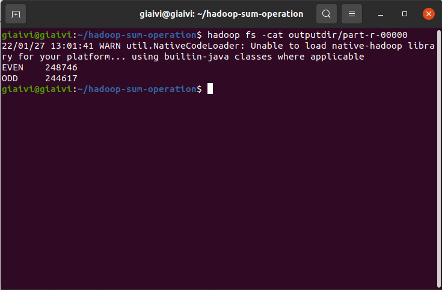

# Sum numbers uses MapReduce in Hadoop HDFS

## Overview
* Project calculate summarization of even numbers and summarization of odd numbers.
* This project uses:
    * Version 
    <table>
    <tr>
        <td>Hadoop</td>
        <td>2.10.1</td>
    </tr>
    <tr>
        <td>Javac</td>
        <td>1.8.0_312</td>
    </tr>
   </table>
   
   * Classes 
    <table>
    <tr>
        <td>Class</td>
        <td>Extends</td>
        <td>Implements</td>
    </tr>
    <tr>
        <td>Map</td>
        <td>MapReduceBase</td>
        <td>Mapper</td>
    </tr>
    <tr>
        <td>Reduce</td>
        <td>MapReduceBase</td>
        <td>Reducer</td>
    </tr>
    <tr>
        <td>Main</td>
        <td>None</td>
        <td>None</td>
    </tr>
   </table>
   
   * input.txt: Input contains random numbers.
## Build project

* Step 1: Export Hadoop classpath
  * *export HADOOP_CLASSPATH=$(hadoop classpath)*
  * *echo $HADOOP_CLASSPATH*
* Step 2: Create compiled directory
  * *mkdir container*
* Step 3: Compile project with Hadoop JARs
  * *javac -cp ${HADOOP_CLASSPATH}:container/:. -d container/ Map.java*
  * *javac -cp ${HADOOP_CLASSPATH}:container/:. -d container/ Reduce.java*
  * *javac -cp ${HADOOP_CLASSPATH}:container/:. -d container/ Main.java*
* Step 4: Create project JAR file
  * *jar -cvf so.jar -C container/ .*
  
## Step & Run project

* Step 1: Create Hadoop input directory for storing our data
  * *hadoop fs -mkdir inputdir*
* Step 2: Copy our local data to Hadoop HDFS directory
  * *hadoop fs -put inputdir/\* inputdir*
* Step 3: Run MapReduce job in Hadoop
  * *hadoop jar so.jar SumOperation.Main inputdir outputdir*
* Step 4: View MapReduce result
  * *hadoop fs -cat outputdir/part-r-00000*

## Demonstration
</img>
